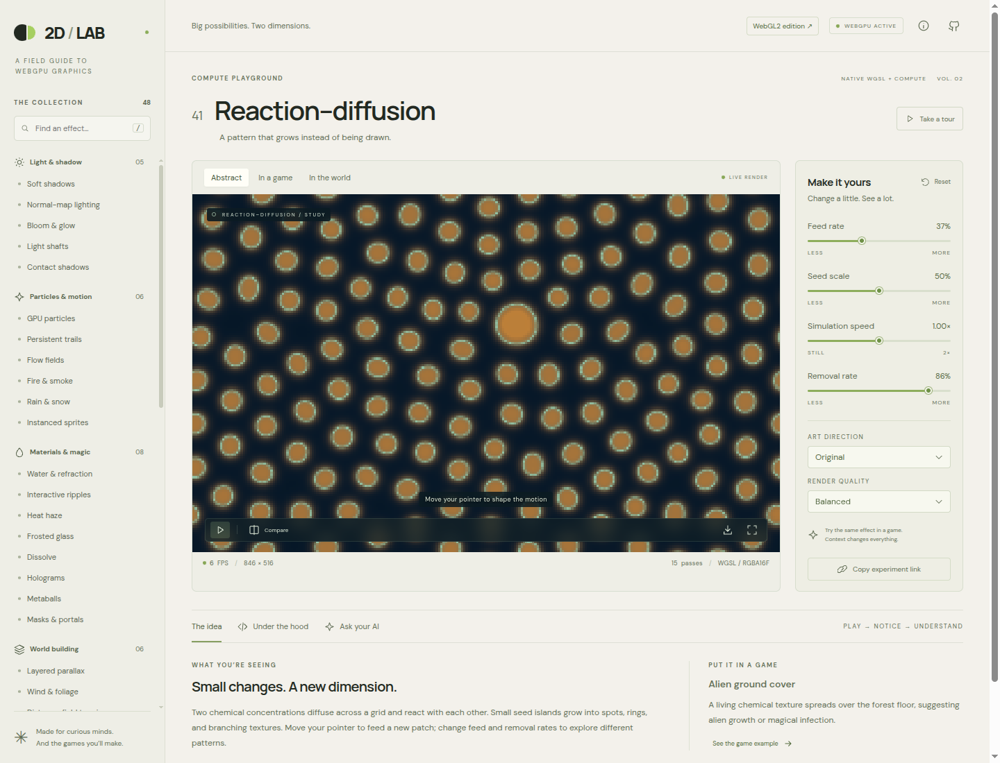
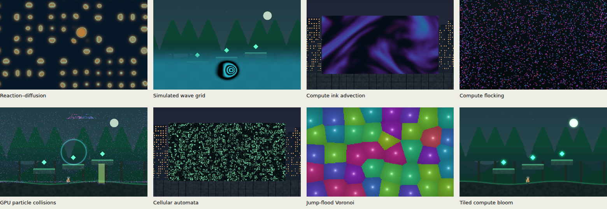
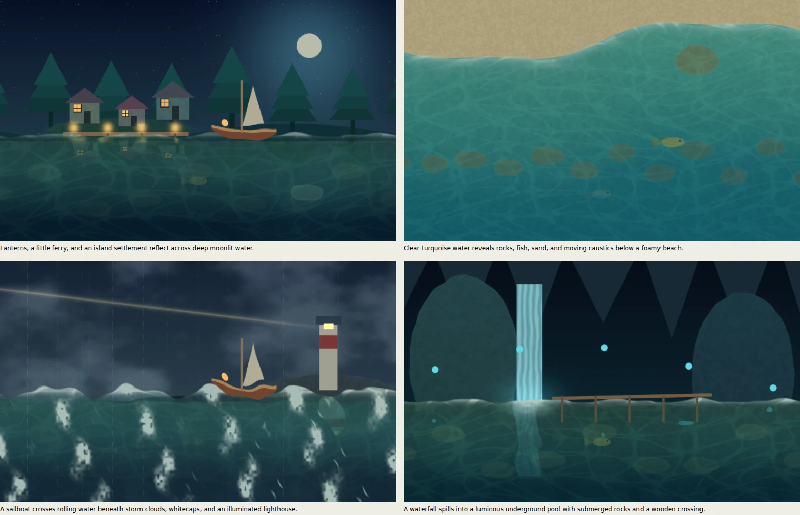

# 2D / Lab — WebGPU + WebGL2

Two interactive editions of a 2D graphics field guide, with native implementations of both APIs.

**[Open WebGPU](https://michaelcrosato.github.io/2d-webgpu-demo-2/)** · **[Open WebGL2](https://michaelcrosato.github.io/2d-webgpu-demo-2/webgl2.html)**

The default **WebGPU edition** has 48 techniques, 144 example contexts, four live controls per technique, five extra water-material controls, and nine combinable art treatments. The preserved **WebGL2 edition** has the original 40 techniques and 120 contexts. Each experiment explains the scene, algorithm, performance costs, and practical limits, and offers a starting prompt for your game.

The WebGPU page requests a device and uses native WGSL render/compute pipelines. It does not silently switch to WebGL. If your browser cannot provide an adapter, explicitly open the separate WebGL2 edition.

Every visit begins with a plain **startup diagnostic screen**. It loads independently of the application bundle, reports your browser and build, checks the WebGPU adapter/device, verifies a small render-and-compute test against known output bytes, compiles the native pipelines, and reads back an actual frame from your selected demo. The lab waits for **Proceed to lab**; animation does not run behind this screen. If graphics initialization fails, **Proceed without GPU rendering** still lets you read the loaded lab. A missing application bundle keeps that button disabled and offers reload and the other edition.

If anything hangs or fails, screenshot the diagnostic screen or use **Save diagnostic report** / **Copy diagnostic report**. The report includes the failed stage, GPU identity and capabilities, current effect/context/settings, completed checks, recent events, and loaded asset URLs. **Diagnostics** in the lab reopens the report and pauses frame submission. Device loss, compilation failures, and GPU work that fails to complete within 30 seconds stop rendering and reopen this screen; recovery requires a deliberate reload rather than repeated automatic device requests. These timeouts require the browser's JavaScript thread to remain responsive; an OS or browser-wide crash can only leave the last displayed stage as evidence.



## Explore

Pick an effect from the searchable collection, then switch between **Abstract**, **In a game**, and **In the world**. Move your pointer to guide lights, focus, portals, particle currents, or simulation sources. Click or tap to trigger a ripple, shockwave, or grid-wave impulse.

Use the sliders, **Compare**, **Reset**, and **Art direction** to explore differences. Pixel art, Cel shading, Watercolor, Ink, Paper cutout, CRT, Halftone, Neon, and Dither process the completed effect through a separate style pass. Save a PNG, copy a link containing the settings, or copy an **Ask your AI** prompt.

**Under the hood** distinguishes physical models from artistic approximations. Short snippets are explanatory pseudocode; complete native shaders are in the repository.

Keyboard: **Space** plays/pauses; **← / →** browse; **R** resets; **/** searches. Tabs support arrow keys, Home, and End. Animation initially pauses for reduced-motion preferences. The optional tour advances every ten seconds.

## Two APIs, different implementations

| Capability | Native WebGPU | Preserved WebGL2 |
| --- | --- | --- |
| Shaders | WGSL | GLSL ES 3.00 |
| Commands | Explicit encoder and render/compute passes | WebGL state and draw calls |
| Particle updates | Compute dispatches, 64 agents per workgroup | Vertex-shader transform feedback |
| Particle state | Read/write storage buffers | Alternating interleaved vertex buffers |
| Instancing | Storage lookup by instance_index | Vertex attributes and divisors |
| HDR targets | Core rgba16float | RGBA16F extension; RGBA8 fallback |
| Grid simulations | Compute kernels and neighboring storage cells | Additional experiments belong to WebGPU |
| Tiled blur | Workgroup memory, barriers, storage textures | Original bloom uses fragment blur passes |

Many visual effects are achievable with either API. Compute examples demonstrate WebGPU’s programming model; similar visuals can also be built using WebGL texture-based techniques.

## The collection

| Area | Techniques |
| --- | --- |
| Light & shadow | Soft shadows; normal lighting; bloom; light shafts; contact shadows |
| Particles & motion | GPU particles; trails; flow fields; fire/smoke; rain/snow; instanced sprites |
| Materials & magic | Water/refraction; ripples; heat haze; glass; dissolve; holograms; metaballs; portals |
| World building | Parallax; wind; distance-field terrain; tilemaps/atlases; sprites; day/night |
| Camera & post | Shockwaves; chromatic aberration; focus/blur; grading; vignette/grain; glitch |
| Art styles | Pixel; cel; watercolor; ink; paper; CRT; halftone; neon; dither |
| WebGPU compute | Gray–Scott reaction–diffusion; wave grid; ink advection; flocking; collisions; cellular automata; jump-flood Voronoi; tiled bloom |

Every **In a game** tab now has an individually authored vignette, rather than reusing a forest background. Examples include a lantern heist for shadows, a crystal cave for bloom, a lightcycle circuit for trails, a lava foundry for heat haze, an ice-shield knight for glass, a teleport departure for localized dissolve, a projected robot companion for holograms, an arcade star patrol for CRT, a reef school for flocking, and a tactical territory board for jump flooding. Each vignette has a matching story and “what to notice” brief. These are visual game prototypes, rather than complete playable games.



The individually composed scenes are shown in these captured GPU galleries: [game studies 1–16](docs/game-vignettes-1.webp), [game studies 17–32](docs/game-vignettes-2.webp), [game studies 33–48](docs/game-vignettes-3.webp).

## Water studio

[Open the water studio](https://michaelcrosato.github.io/2d-webgpu-demo-2/#effect=water&scene=1).

Four authored settings show different water applications: **Moonlit lagoon**, **Tropical shallows**, **Storm coast**, and **Cavern spring**. The material combines multi-direction waves and normals, depth-tinted refraction, a Schlick-style view-angle reflection proxy, animated caustics, shoreline/crest foam, normal-based highlights, and click-triggered ripple impulses. A boat or bridge is composited in front of the water for the game scene.



Five additional controls expose clarity, reflection strength, foam, sparkle, and depth absorption; settings and values survive copied links. The simulated-wave game example shades the cavern pool using its persistent compute height field, while the lily pond shows analytic ripple distortion around stepping stones.

These remain 2D artistic depth/view approximations: there is no ray-traced refraction, 3D Fresnel measurement, or fluid-volume solver. The sources below explain the physical ideas behind the visual cues:

- [NVIDIA GPU Gems: Effective Water Simulation](https://developer.nvidia.com/gpugems/gpugems/part-i-natural-effects/chapter-1-effective-water-simulation-physical-models)
- [NVIDIA GPU Gems: Water Caustics](https://developer.nvidia.com/gpugems/gpugems/part-i-natural-effects/chapter-2-rendering-water-caustics)
- [NVIDIA GPU Gems 2: Generic Refraction](https://developer.nvidia.com/gpugems/gpugems2/part-ii-shading-lighting-and-shadows/chapter-19-generic-refraction-simulation)

## Run locally

Requires Node.js 22.12+ or 24+. WebGPU needs a browser/device that provides an adapter and a secure context: **HTTPS or localhost**. WebGL2 remains available separately.

```sh
npm ci
npm run dev
```

Open the printed localhost address for WebGPU; append `/webgl2.html` for WebGL2. No API key, backend, downloaded game art, or paid service is needed. Google Fonts is optional; local fallbacks work if it cannot load.

```sh
npm run check                     # Biome checks
npm run build                     # Type-check and build both editions
npm run preview                   # Serve production build
npx playwright install chromium --no-shell # Pinned browser for WebGPU tests
npm test                          # Both native GPU/browser suites
npm test -- --project=webgpu
npm test -- --project=webgl2
```

WebGPU tests use Playwright’s bundled Chromium locally and in CI; WebGL2 tests use Chrome at `/usr/bin/google-chrome`. Set `CHROME_PATH` to override either executable. CI runs under Xvfb. Its compositor uses ANGLE SwiftShader while the actual WebGPU device uses Vulkan SwiftShader; GPU compositing is explicitly enabled. The suite reads real output textures into mapped buffers and exercises canvas presentation, with no application-level WebGL fallback. Use `xvfb-run -a npm test` locally. Browser launch flags belong to the tests, not the deployed application.

Suites cover 144 WebGPU and 120 WebGL2 contexts, distinct unprocessed game compositions for all 48 techniques, four water settings and five material controls, validation errors, forbidden WebGL fallback, simulation evolution, pause, controls, style composition, links, PNG bytes, mobile, reduced motion, unsupported APIs, and device/context recovery.

## WebGPU frame graph

1. **Compute state:** agent kernels integrate storage-buffer state. Grid kernels update concentrations, heights, dye, living cells, or nearest seeds. Separate dispatches ensure each solver step observes the completed prior step.
2. **Scene:** a fullscreen-triangle pipeline shades procedural geometry, distance fields, landscapes, surfaces, and a locally generated sprite atlas. Compute scenes read the current simulation buffer.
3. **Instances:** a vertex shader reads agent state by instance_index, drawing the population in one call.
4. **History:** alternating float textures preserve fading trails.
5. **Blur:** regular effects use separable render passes. Tiled compute bloom loads 64 pixels and an eight-pixel halo into shared memory, synchronizes every lane, and writes a 17-tap convolution into storage textures.
6. **Effect/style:** material and camera effects finish before the optional style pass, preserving dissolve under pixel sampling. Tone mapping runs once at final output.
7. **Present/export:** an RGBA8 output texture is presented to the canvas. PNG export copies that same texture to a row-aligned buffer and encodes its actual bytes, independently of presentation timing.

Submissions are limited to two frames in flight to prevent unbounded GPU queues; queue completion and output readback have 30-second deadlines. FPS counts submitted frames under bounded scheduling, not isolated GPU execution time. Pass counts include render, compute, and presentation. The default quality is Economy, with higher resolutions available explicitly. Compute fields use a fixed 256 × 160 grid.

Scene and post-processing pipelines specialize the selected effect through a WGSL override constant, allowing the compiler to remove unused effect branches. They compile asynchronously, one pipeline at a time, with a cache limited to eight effects. Rapid changes select the latest requested demo without adding every intermediate choice to the compilation queue. Pending compilation shows a visible preparation message and does not count as a rendered frame; PNG export waits for the requested effect. The WebGPU sweep identifies each effect/context as a test step and checks cache eviction as well as rendered output. Dedicated startup tests inject missing assets, missing APIs/adapters, device errors, compilation stalls, queue stalls, and rapid selection changes.

## Simulation boundaries

- Reaction–diffusion is a discrete Gray–Scott model with periodic boundaries and fixed solver steps, not calibrated chemistry.
- Grid waves preserve height/velocity state; they are not a water-volume solver.
- Ink advection transports dye through prescribed currents, without an incompressible-fluid pressure solve.
- Flocking samples 64 candidates per agent, rather than performing an exhaustive neighborhood search.
- Collisions are discrete point tests against a circle, box, and floor. No particle-to-particle or swept collision is included.
- Cellular automata use Conway’s rule, wrapped edges, and an age channel for glow.
- Jump flooding approximates nearest-seed regions; it is not guaranteed to be an exact distance solver in every arrangement.
- Compute bloom demonstrates synchronization and tiled convolution. No universal speedup over fragment blur is claimed.

The shared effects retain their [documented visual approximations](docs/webgl2.md#practical-boundaries), including screen-space water, procedural normals, stylized shafts, and visual terrain without gameplay collision.

## Source

| File | Purpose |
| --- | --- |
| [WebGPU renderer](src/webgpu/renderer.ts) | Resources, pipelines, command graph, compute, lifecycle, readback |
| [Native WGSL shaders](src/webgpu/shaders) | Scene, post, particles, grid simulation, tiled convolution |
| [Compute catalog](src/webgpu/catalog.ts) | Eight extra lessons, controls, contexts, prompts, limits |
| [Game vignettes](src/game-scenes.ts), [water material](src/water.ts) | Authored scene geometry, matching game briefs, and water settings, emitted into native shaders for both APIs |
| [Shared catalog](src/catalog.ts), [edition selection](src/edition.ts) | Original techniques and API-specific explanations |
| [WebGL2 renderer](src/renderer.ts), [GLSL](src/shaders.ts) | Preserved native WebGL2 implementation |
| [UI](src/main.ts), [styles](src/style.css), [atlas](src/atlas.ts) | Shared interface and generated art |
| [WebGPU tests](tests/webgpu.spec.ts), [WebGL2 tests](tests/lab.spec.ts) | Actual GPU/browser verification |

For developer inspection, `window.lab.backend`, `window.lab.stats()`, and `await window.lab.readPixels()` expose the backend, pass/instance counts, and output bytes. `window.lab.loseDevice()` exercises recovery. These inspect the real renderer.

## References

- [WebGPU specification](https://gpuweb.github.io/gpuweb/)
- [WGSL specification](https://gpuweb.github.io/gpuweb/wgsl/)
- [WebGPU explainer](https://gpuweb.github.io/gpuweb/explainer/)
- [API correspondence](https://gpuweb.github.io/gpuweb/correspondence/)
- [Original WebGL2 guide](docs/webgl2.md)

All game graphics are generated locally. Source is available under the [MIT license](LICENSE).
