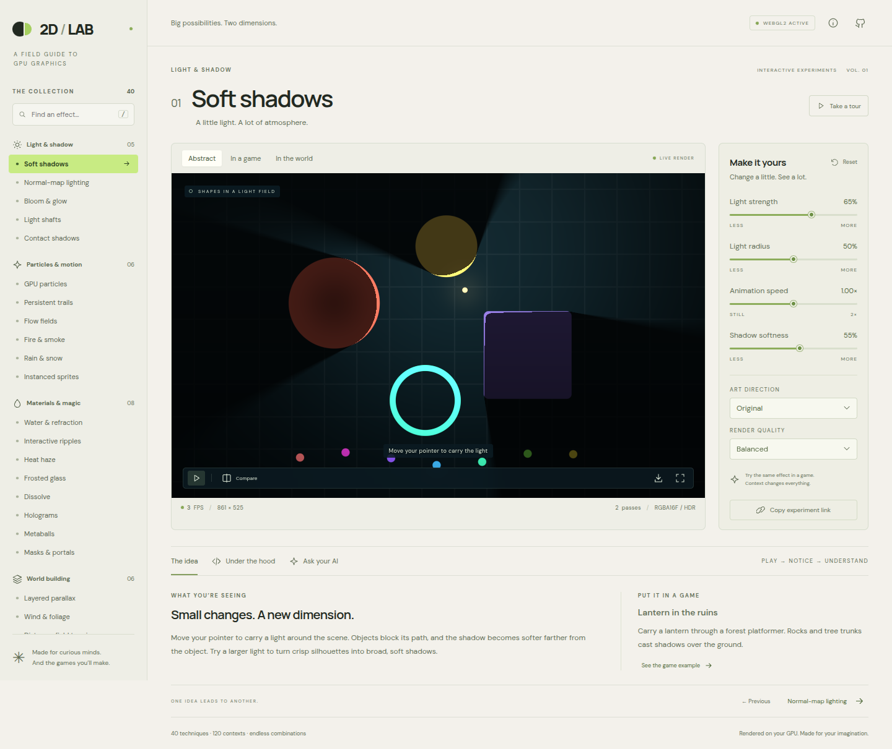

# 2D / Lab — WebGL2 edition

An interactive field guide to GPU graphics for people making 2D games with AI.

**[Open the lab](https://michaelcrosato.github.io/2d-webgpu-demo-2/webgl2.html)** · **[Browse the shaders](../src/shaders.ts)**

40 techniques, 120 example contexts, four live controls per technique, and nine combinable art treatments. Each experiment includes an explanation, the underlying algorithm, performance considerations, and a starting prompt you can use when asking an AI to implement it in your game.



## Explore

- Pick an effect from the searchable collection.
- Switch between **Abstract**, **In a game**, and **In the world**. The contexts use a geometric study, a forest platformer illustration, and a city or surface illustration.
- Move the pointer to control lights, particle currents, glass, portals, or focus. Click or tap to launch a ripple or shockwave.
- Adjust the four sliders. Their labels change with the technique.
- Combine an effect with **Pixel art, Cel shading, Watercolor, Ink, Paper cutout, CRT, Halftone, Neon, or Dither**.
- Use **Compare** for a clean scene beside the processed result. **Reset** restores the current experiment.
- Save a PNG or copy a URL that preserves the effect, context, style, parameters, and quality.
- Read **Under the hood** for the GPU recipe and its limitations. **Ask your AI** provides an implementation prompt.

Keyboard: **Space** plays/pauses, **← / →** selects experiments, **R** resets, **/** searches. Context and lesson tabs support arrow keys, Home, and End. Animation initially pauses if your device requests reduced motion. The tour advances every ten seconds and can be stopped at any time.

## The collection

| Area | Techniques |
| --- | --- |
| Light & shadow | Soft shadows; normal-map lighting; bloom & glow; light shafts; contact shadows |
| Particles & motion | GPU particles; persistent trails; flow fields; fire & smoke; rain & snow; instanced sprites |
| Materials & magic | Water & refraction; interactive ripples; heat haze; frosted glass; dissolve; holograms; metaballs; masks & portals |
| World building | Layered parallax; wind & foliage; distance-field terrain; tilemaps & atlases; sprite animation; day / night cycle |
| Camera & post | Shockwaves; chromatic aberration; focus & blur; color grading; vignette & film grain; digital glitch |
| Art styles | Pixel art; cel shading; watercolor; ink & hatching; paper cutout; CRT monitor; comic halftone; neon wire; dither & palette |

This is a broad, extensible catalog of practical 2D techniques. Graphics is open-ended: it cannot literally enumerate every possible effect. The examples are illustrative scenes, rather than playable games, and the explanations distinguish artistic approximations from physical simulation.

## Run locally

Requires Node.js 22.12+ or 24+ and a browser with WebGL2.

```sh
npm ci
npm run dev
```

Open `/webgl2.html` at the local address printed by Vite. No API key, server backend, downloaded art, or paid service is needed. Google Fonts is optional; local font fallbacks work if it cannot load.

```sh
npm run build       # Type-check and build dist/
npm run preview     # Serve the production build
npm test            # Actual WebGL2 browser tests
```

Tests use an installed Chrome at `/usr/bin/google-chrome` and software WebGL through SwiftShader, so a physical GPU is not required in CI. Set `CHROME_PATH` to your Chrome or Chromium executable on another machine. Tests inspect framebuffer pixels and WebGL errors across all 120 contexts, validate visible slider/style changes, and exercise interaction, links, export, mobile, reduced motion, unsupported-GPU handling, and context restoration.

## How the renderer works

The implementation uses **WebGL2**, which the original brief allowed alongside WebGPU. It has no graphics-engine dependency.

1. **Scene pass.** A fullscreen triangle renders procedural geometry, landscapes, surfaces, and a locally generated pixel-art texture atlas. Signed distance fields describe obstacles and masks. Lighting uses distance-field ray marching and procedural height-field normals.
2. **Particle update.** A vertex shader integrates particle state using WebGL2 transform feedback. Two interleaved position/velocity/age/seed buffers alternate; particle updates do not loop over positions in JavaScript.
3. **Instanced drawing.** One quad is repeated for up to 10,000 particles or 4,000 animated sprites. Alpha or additive blending composites the instances into the scene target.
4. **Frame history.** Trails and flow fields retain a faded previous frame using two alternating framebuffer textures.
5. **Blur.** Effects that need blur use horizontal and vertical Gaussian passes at half resolution. Bloom extracts highlights before blurring.
6. **Effect composite.** A fragment shader applies material distortion, camera effects, or the experiment's art treatment. When an extra art direction is selected, this completed effect goes into another render target, and a separate pass styles that result. This preserves distortion and dissolve under pixel/CRT treatments. Tone mapping occurs only at the final output. Comparison renders an additional clean scene with the technique disabled.

When `EXT_color_buffer_float` is available, render targets use **RGBA16F** to retain bright values for bloom. Otherwise, the lab uses **RGBA8**; glow still works, with a smaller dynamic range. The renderer checks framebuffer completeness, disposes replaced resources on resize, suspends rendering when the tab is hidden, and recreates resources after a restored context.

The on-screen FPS is delivered animation frames per wall-clock second, not a GPU timer. The displayed pass count includes particle update/draw calls as well as framebuffer passes. **Economy**, **Balanced**, and **High detail** cap render width and device-pixel ratio to manage fill rate.

## Practical boundaries

- Water uses screen-space reflection/refraction and analytic ripples, not a fluid solver. Flow fields guide particles, rather than solving Navier–Stokes equations.
- Normal lighting derives a normal from a height field; a production sprite system would commonly use authored normal-map textures.
- Light shafts and contact shadows use artistic screen-space approximations. Distance-field shadows account for the demo's defined obstacles, not every decorative pixel.
- Terrain is visual. A game must connect its field to collision and gameplay systems.
- Paper, watercolor, and neon are image treatments. Neon detects screen-space contours rather than rendering mesh wireframes.
- The portal shows a transformed version of the existing scene. A game can replace this sample with a separately rendered destination scene.
- The short lesson snippets are pseudocode. `src/shaders.ts` contains the actual GLSL ES 3.00 programs.

## Source map

| File | Purpose |
| --- | --- |
| [src/catalog.ts](../src/catalog.ts) | Lessons, control labels, defaults, examples, prompts, and performance notes |
| [src/shaders.ts](../src/shaders.ts) | GLSL scene, material, post-process, blur, feedback, and particle programs |
| [src/renderer.ts](../src/renderer.ts) | WebGL2 resources, atlas generation, transform feedback, instancing, and render passes |
| [src/main.ts](../src/main.ts) | UI, controls, pointer/keyboard interaction, links, export, tour, and lifecycle |
| [src/style.css](../src/style.css) | Responsive lab interface |
| [tests/lab.spec.ts](../tests/lab.spec.ts) | Browser and actual framebuffer verification |

To add an experiment, append an entry to the catalog and implement its scene/post shader branch. Keep the catalog's index aligned with the shader's effect ID. Add truthful descriptions, three contexts, four meaningful parameters, and a practical prompt, then run the browser suite.

## References

- [MDN: WebGL2RenderingContext](https://developer.mozilla.org/en-US/docs/Web/API/WebGL2RenderingContext)
- [MDN: Transform feedback](https://developer.mozilla.org/en-US/docs/Web/API/WebGLTransformFeedback)
- [MDN: Instanced rendering](https://developer.mozilla.org/en-US/docs/Web/API/WebGL2RenderingContext/drawArraysInstanced)
- [Khronos: WebGL 2.0 specification](https://registry.khronos.org/webgl/specs/latest/2.0/)
- [Khronos: Floating-point color buffers](https://registry.khronos.org/webgl/extensions/EXT_color_buffer_float/)

All graphics and the sprite atlas are generated locally by the application. Source is available under the [MIT license](../LICENSE).
